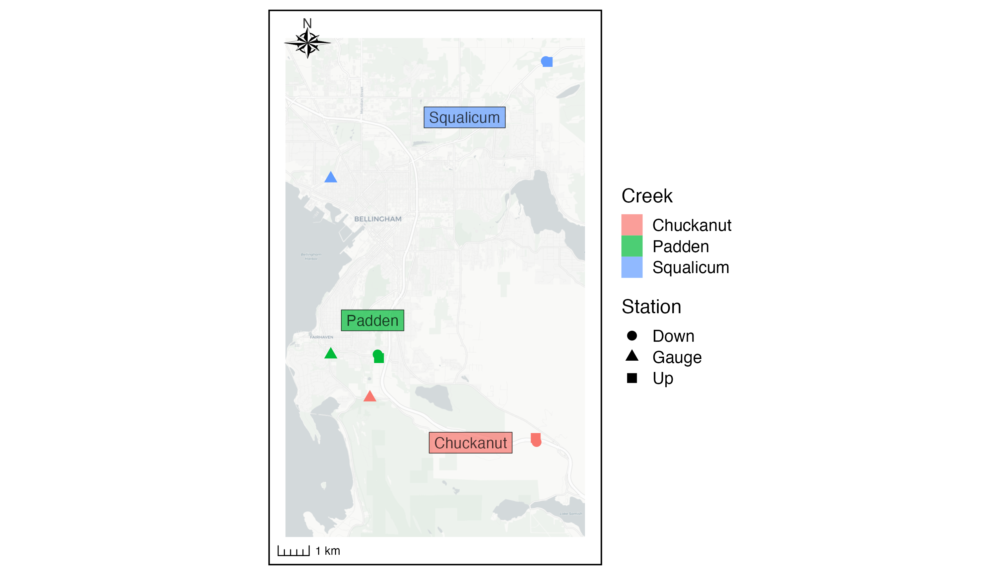
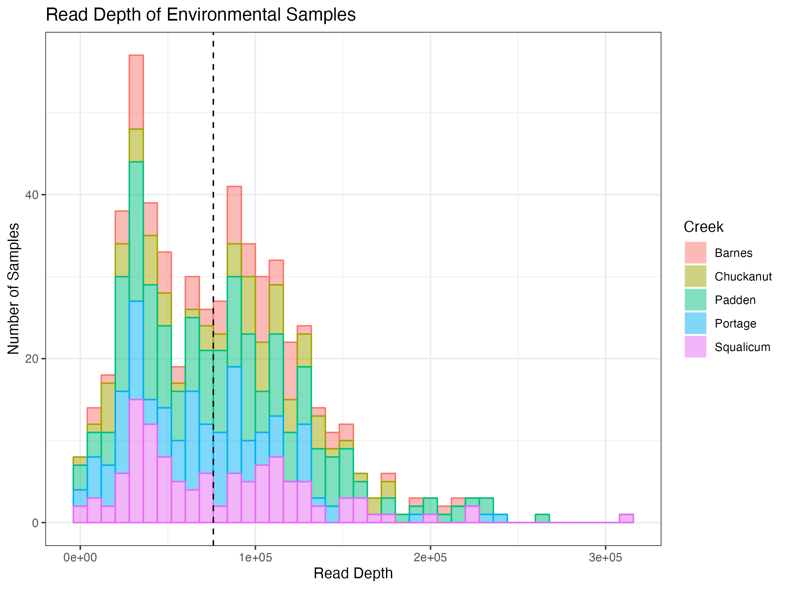
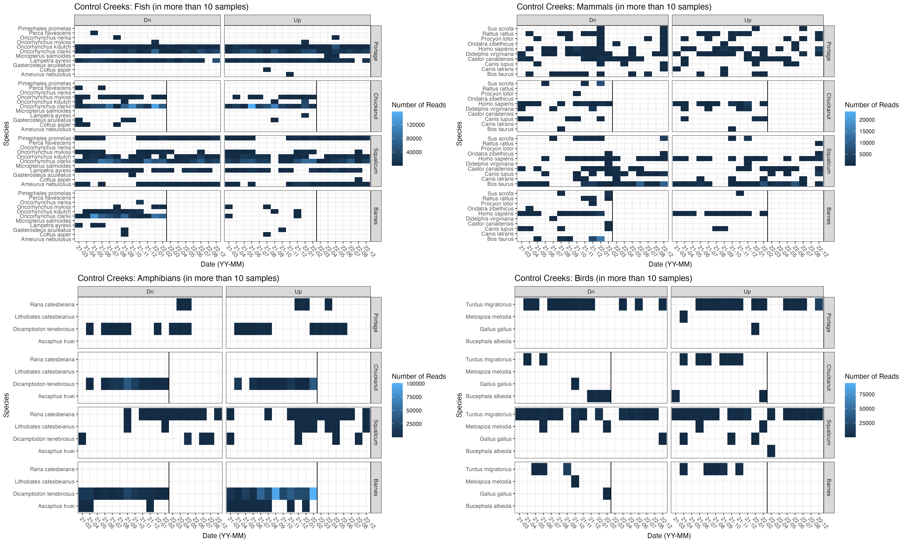
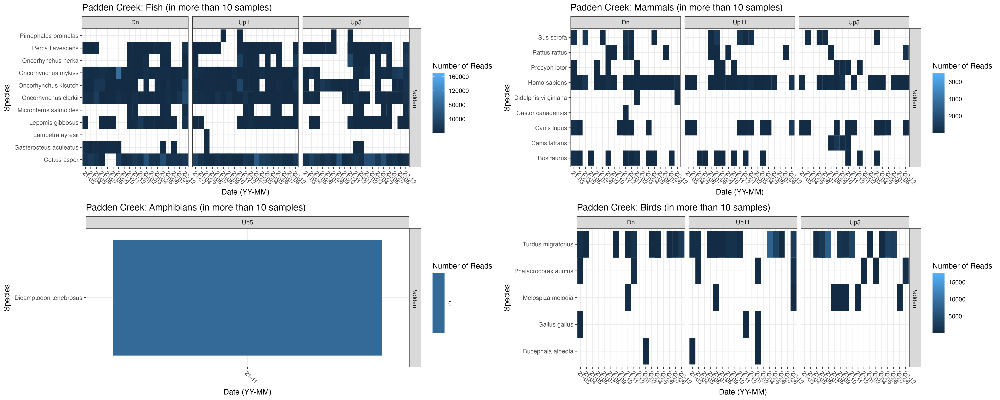
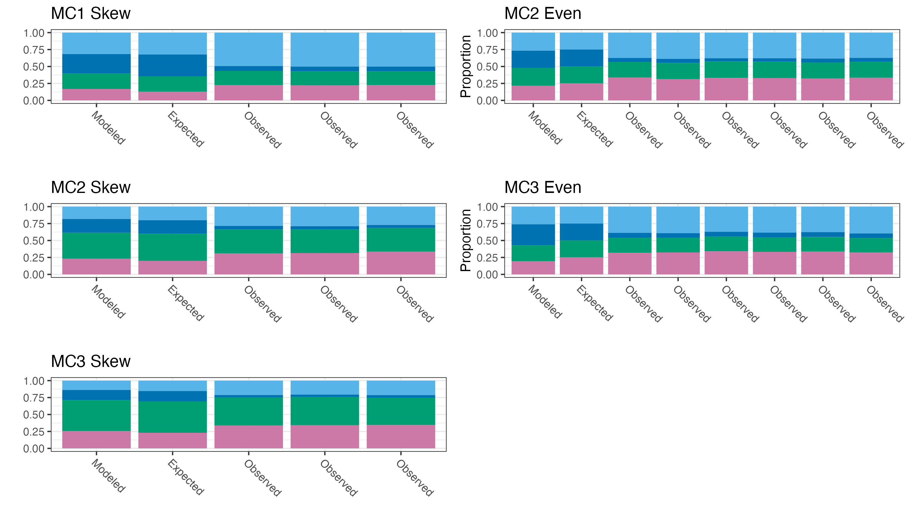

```{r setup, include=FALSE}
knitr::opts_chunk$set(echo = TRUE, fig.pos = "H", out.extra = "")

library(here)
```

## Field Sampling

### Site selection and study design 

There were two culverts in the treatment creek (Padden) that were suspected to be partially impassible and thus was removed and replaced during the course of the study; one of the control creeks had a bridge, which allowed fish passage (Portage), one control creek had a culvert classified as having limited fish passability (Squalicum), and two control creeks had culverts classified as preventing fish passage (Barnes and Chuckanut) [@washingtondepartmentoffishandwildlife2019]. These creeks were chosen due to their comparable size, flow, watersheds, and species presumed to be present to constrain as many ecological variables as possible.

### Distance between sites and flow variability at sites

The average distance between upstream and downstream sampling within a creek was about 160 m; the largest distance between downstream and upstream sampling was at Barnes Creek, which was approximately 330 m, whereas the shortest distance between sampling was at Squalicum Creek at approximately 66 m.

Over the course of the year, flow within each creek varied. USGS flow gauges were located in three of the five creeks, relatively nearby to the sampling locations (Figure S1.\ref{fig:gaugemap}). The closest gauge to sampling locations was Padden Creek (\~1.5 km); the gauge at Chuckanut Creek was \~5.5 km and the gauge at Squalicum Creek was \~7.9 km away (calculated using the Haversine distance in R).



The flow meters at Squalicum Creek and Chuckanut Creek were offline from November 2021 for the remainder of the sampling period. The highest discharge seen during the course of the study from January to November 2021 occurred in November 2021 at Squalicum Creek. The mean discharge in each creek was: 0.42 m\textsuperscript{3}/s in Padden, 0.29 m\textsuperscript{3}/s in Chuckanut, and 1.14 m\textsuperscript{3}/s in Squalicum Creek. The lowest discharge registered by the flow meters is 0.0028 m\textsuperscript{3}/s, which occurred 8.5%, 1.6%, and 0.78% of the time in Padden, Chuckanut, and Squalicum, respectively.

Due to the lack of flow data in Squalicum and Chuckanut Creeks from November 2021 to February 2022, we used historical data from the three flow gauges to calculate the average discharge for each day of the year from about 2015-2021 (Figure S1.\ref{fig:dischargesupp}). We then used the value for the day of the year that we sampled in either 2021 or 2022 when the gauges were offline. For consistency, we also did this at Padden Creek despite the gauge there being online for the entire sampling period.


We compared the different ways one could use flow data to correct the eDNA concentrations. We included (1) the value from the closest time point from the gauge to the time point sampling, (2) the average flow on the day of sampling from the gauge, (3) the monthly average for the month of sampling from the gauge, and (4) the correction factor approach. For (4), the values for Padden Creek represent the same as (1) for Padden Creek, the value from the closest time point in the gauge to the time point of sampling. The values for Chuckanut and Squalicum Creek are based on the the correction factor from Padden Creek. First, five years of historical data (2015-2020) were used to find monthly averages for flow rates for each creek. Because the gauges in Squalicum and Chuckanut Creeks stopped metering in 2021, we solved for the ratio of the monthly average of each of those creeks to Padden Creek. Then, we used the closest values from Padden Creek (1) and multiplied by the monthly correction factor from the 5 years of historical data to find a value for Squalicum and Chuckanut Creeks to use for the year of sampling (2021-2022). For all three creeks, we demonstrate the relatively small changes in discharge depending on which way flow data were used (Figure S1.\ref{fig:dischargemethod}). Though in the course of sampling, the discharge in Padden Creek ranged from no metered flow to 23 m\textsuperscript{3}/s, the discharge on the dates of sampling only reached a maximum of 1.3 m\textsuperscript{3}/s. For sites with no metered flow, half of the minimum verified discharge of the flow gauge was used (0.0014 m\textsuperscript{3}/s).


### Construction and Fish Exclusion 

Fish were excluded from Padden Creek on August 30th, 2021 in preparation for the stream to be diverted on September 9th, 2021 and the diversion was removed October 7th, 2021. Water sampling occurred on September 10th, 2021, the day after the diversion, and on October 12, 2021, just 5 days after reconnecting the stream (Figure S1.\ref{fig:timeline}). 

### Stocking in Lake Padden

Padden Lake has historically been stocked with hatchery fish by the Washington Department of Fish and Wildlife (Figure S1.\ref{fig:timeline}). Rainbow trout (*O. mykiss*) and occassionally cutthroat trout (*O. clarkii*) and kokanee salmon (*O. nerka*) are stocked in Lake Padden, approximately 1.5 km upstream of the sampling sites. During the course of the study, rainbow trout were stocked in April 2021 and April 2022, kokanee salmon were stocked in May 2021 and October 2022, and cutthroat trout were stocked in November 2022 (Figure S1.\ref{fig:timeline}). However, despite the stocking of 30,000 kokanee salmon in May in Lake Padden, O. nerka was not detected by metabarcoding in May 2021 or at any point in 2021 until November (see main text Results). Importantly, this suggests that Lake Padden is far enough upstream that the eDNA signal at the sampling sites by the culvert is not a result of stocking the lake 1.5 km upstream (see main text Discussion for more information).


### Water Sampling

Water samples were collected using Smith Root's eDNA Backpack [@thomas2018a], a portable pumping-and-filtering setup set to filter at 1 L/min at 82.7 kPa (12 psi). For most months, a trident sampler was used to collect all 3 biological replicates at the exact same time, for a total sampling time of about 5 minutes. Otherwise, the three replicates were collected consecutively, for a total sampling time of about 15 minutes. Downstream sites were always sampled before upstream sites to ensure no potential DNA was introduced into the stream before sampling. In some samples, less than 2 L of water was filtered due to clogging (mean = 1.95 L). 

## Laboratory Processing

### DNA Extraction, Amplification, Sequencing

Here, we used mock communities to determine the species-specific amplification efficiencies for each salmonid in the study. Briefly, we constructed five communities with known proportions of starting DNA from different species (total DNA as measured by Qubit). The communities ranged from having a total of 12 to 20 species, but six salmonid species were included in all five mock communities to have more information on the amplification efficiencies of salmonids (Supplemental Table 2). We sequenced these communities using the same metabarcoding primers and thermocycling conditions above and then determined the species-specific amplification rates given the discrepancy between the known starting proportion and the proportion of reads after sequencing. The mock community data were then used to correct the sequencing reads from the environmental samples to estimate the starting DNA proportions of each species in environmental samples, which is the metric of interest (Figure 3, green boxes). This is the first application of the model to correct eDNA data from water samples with mock community data as described in @shelton (see Supplemental Text 2 for more information).

All molecular work prior to sequencing was performed at the University of Washington. Bench-tops were cleaned with 10% bleach for 10 minutes and then wiped with 70% ethanol. Molecular work was separated onto pre- and post-PCR benches; all DNA extractions and PCR preparation was conducted on a bench where no PCR product was handled.

### DNA Extractions

We followed a protocol developed for extracting DNA off the self-preserving Smith Root filters [@thomas2019]. Filters were removed from their housing with sterile tweezers and cut in half using sterile razor blades. One half was archived and the other half was used for extraction. DNA was extracted from half of each filter using a Qiashredder column (Qiagen, USA) and the DNeasy Blood and Tissue Kit (Qiagen, USA) with an overnight incubation (@thomas2019), such that the effective filtering effort was 1 L/sample; the remaining half of each filter was archived at -20\degree C. Extracts were eluted in 100 $\mu$L of molecular grade water, quantified via Qubit (Invitrogen, USA) and stored at -20\degree C until PCR amplification within 2 months of extraction.

### PCR Amplification

For the metabarcoding approach, we targeted a \~186 bp hypervariable region of the mitochondrial DNA 12S rRNA gene for PCR amplification (MiFish; Miya et al. 2015), but using modified primer sequences as given in Praebel and Wangensteen (unpublished; via personal communication) and including the Illumina Nextera overhang sequences for subsequent indexing. The primers used were as follows: F 5' *TCGTCGGCAGCGTCAGATGTGTATAAGAGACAG*GCCGGTAAAACTCGTGCCAGC 3', R 5' *GTCTCGTGGGCTCGGAGATGTGTATAAGAGACAG*CATAGTGGGGTATCTAATCCCAGTTTG 3' (*italics* indicate Nextera overhang). PCR reactions included 10 $\mu$L of 5X Platinum ii Buffer, 0.4 $\mu$L of Platinum ii Taq, 1.25 $\mu$L of 8 mM dNTPS, 1.25 $\mu$L of 10 $\mu$M F primer, 1.25 $\mu$L of 10 $\mu$M R primer, 5 $\mu$L of template, and 30.85 $\mu$L of molecular grade water, for a total reaction volume of 50 $\mu$L. Cycling conditions were as follows: 95\degree C for 2 min, 35 cycles of 95\degree C for 30 sec, 60\degree C for 30 sec, 72\degree C for 30 sec, followed by a final extension of 72\degree C for 5 min.

Each month of samples was amplified on a single plate with the addition of a no template control (NTC; molecular grade water in lieu of template) and a positive control (genomic DNA from kangaroo). After PCR amplification, PCR products were visualized on a 1-2% gel. If no band was present for a given sample, a new amplification was attempted with extracts diluted 1:10 iteratively until a band was detected. PCR products were size-selected and cleaned using MagBind Beads (Omega Biotek, USA) at a sample:beads ratio of 1.2. Bead-cleaned PCR products were eluted in 30 $\mu$L of molecular grade water and quantified via Qubit (Invitrogen, USA).

An indexing PCR reaction added a unique index to each sample using Nextera indices (Illumina, USA) to allow pooling multiple samples onto the same sequencing run. For indexing, 10 ng of PCR product was used as template in a final volume of 11.25 $\mu$L. For samples with concentrations less than 0.88 ng/$\mu$L, 11.25 $\mu$L was added despite being less than 10 ng of amplicon. Each sample received a unique index; Nextera index sets A and B were used to avoid using the same index for more than one sample on a single sequencing run. The PCR reaction included the 11.25 $\mu$L of template, 12.5 $\mu$L of Kapa HiFi MMX (Roche, USA), and 1.25 $\mu$L of indexed primer. Cycling conditions were as follows: 95\degree C for 5 min, 8 cycles of 98\degree C for 20 sec, 56\degree C for 30 sec, 72\degree C for 3 min, and a final extension of 72\degree C for 5 min.

Indexed PCR products were also size-selected and purified using MagBind Beads (Omega Biotek, USA) at a sample:beads ratio of 0.8. Bead-cleaned PCR products were eluted in 30 $\mu$L of molecular grade water and quantified via Qubit. Indexed and bead-cleaned products were normalized before pooling into libraries, which were subsequently quantified via Qubit and visualized on a Bioanalyzer (Agilent, USA) before sequencing. Samples were randomized in 3-month blocks and each block split across 3 sequencing runs, for a total of 12 sequencing runs. The loading concentration of each library was 4-8 pM and 5-20% PhiX was included depending on the composition of the run. Sequencing was conducted using an Illumina Miseq with v3 2x300 chemistry at the NOAA Northwest Fisheries Science Center and the University of Washington's Northwest Genomics Center.

### Species Specific qPCR

We quantified cutthroat trout (*O. clarkii*) DNA in each sample, targeting a 114 bp fragment of the cytochrome b gene with a qPCR assay [@duda2021]. The primer/probe sequences were: F 5' CCGCTACAGTCCTTCACCTTCTA 3', R 5' GATCTTTGTATGAGAAGTAAGGATGGAA 3', P 5' 6FAM-TGAGACAGGATCCAAC-MGB-NFQ 3'. The qPCR assay was multiplexed with TaqMan Exogenous Internal Positive Control Reagents (EXO-IPC) (Applied Biosystems, USA) to check for the presence of PCR inhibitors [@duda2021]. Each DNA sample was run in triplicate using Gene Expression Mastermix (ThermoFisher, USA), a final concentration of 0.375 $\mu$M F primer, 0.375 $\mu$M R primer, and 0.105 $\mu$M probe, as well as 1X EXO-IPC mix, 1X EXO-IPC DNA, 3.5 $\mu$L of template for a final reaction volume of 12 $\mu$L. The EXO-IPC mix includes the primers and probe for the EXI-IPC DNA, with the probe having a VIC reporter, allowing it to be multiplexed with the *O. clarkii* assay, which has a FAM reporter. All qPCRs were conducted on an Applied Biosystems StepOnePlus thermocycler.

Thermocycling was as follows: 50\degree C for 2 min, 95\degree C for 10 min, followed by 45 cycles of 95\degree C for 15 sec, 60\degree C for 1 min. The cycle threshold (Ct) value determined for the EXO-IPC assay from the NTC was compared to the Ct value for the EXO-IPC assay in each of the environmental samples. If the Ct value was \>0.5 Ct values from the mean Ct for the NTCs, the sample was deemed inhibited and diluted 1:10 and re-assayed until the Ct value fell within the accepted range. After converting Ct values to DNA concentrations using the standard curve (see below), the concentration was multiplied by the dilution factor.

Each plate included a 8-point standard curve created using synthetic DNA (gBlocks) at the following concentrations: 100,000 copies/$\mu$L, 10,000 copies/$\mu$L, 1,000 copies/$\mu$L, 100 copies/$\mu$L, 10 copies/$\mu$L, 5 copies/$\mu$L, 3 copies/$\mu$L, 1 copy/$\mu$L Additionally, six no template controls (NTCs) were included on each plate: 3 with the IPC DNA mix and 3 with molecular grade water instead of template or IPC DNA mix. Plates were re-run if efficiency as determined by the standard curve was outside of the range of 90-110%.

To check for inhibition, the cycle threshold (Ct) value determined for the EXO-IPC assay from the NTC was compared to the Ct value for the EXO-IPC assay in each of the environmental samples. If the Ct value was \>0.5 Ct values from the mean Ct for the NTCs, the sample was deemed inhibited and diluted 1:10 and re-assayed until the Ct value fell within the accepted range. The majority of environmental samples (60%) were inhibited and accordingly diluted for analysis. In 80% of inhibited samples, a 1:10 dilution or less remedied the inhibition, but some samples (11%) required dilution by a factor of up to 1000.

## Bioinformatics Processing

Primers were removed with cutadapt [@martin2011a] and then reads were de-noised, filtered, merged, and ASVs were generated using dada2 [@callahan2016a]. For each MiSeq run, the trimming lengths were determined by visually assessing the quality score plots. After ASVs were generated, taxonomy was assigned using the "classify" function in the insect package in R using the classifier published by the authors of the package [@wilkinson2018].

### Quality Controls

Positive controls were included on each sequencing run to monitor for cross contamination that might have occurred in the laboratory or due to "tag jumping". With 13 MiSeq runs, we included one sample of kangaroo tissue on each run and then measured how many reads of kangaroo were found in environmental samples and how many reads of non-kangaroo were found in kangaroo samples (Figure S1.\ref{fig:controls1}).


We can also check to make sure that no reads assigning to kangaroo were in the environmental samples. We only found kangaroo in two environmental samples, both of which were a very small number (and proportion) of reads (2 and 136 reads found in samples with 40,425 and 28,725 reads respectively) (Figure S1.\ref{fig:controls2}).


### Annotation

We first used a tree-based annotation method (insect package) and then followed up with a BLAST search for all ASVs that were not annotated to species level by insect. The percent of reads annotated did not correlate with sample read depth, creek, station, or month of sampling. Read depth across samples ranged from 1,011 to 311,879, with a mean of 79,709 and median of 75,967 reads (Figure S1.\ref{fig:readdepth}). With a total of \~565 samples, 93% of samples had \>20,000 reads and 65% of samples had over 50,000 reads. There did not seem to be a pattern with samples of low reads with creek or time. Additionally, of the low read depth samples (\<20,000 reads, 40 samples), there was only one sample in which all three replicates were low (March 2022 Squalicum Upstream), meaning that it is very unlikely that low read depth samples would have lead to changing ecological results.



A total of 81 unique species were identified in the environmental samples by the MiFish primers, including 25 fish, 25 mammals, 23 birds , and 8 amphibians (Figure S1.\ref{fig:controlreads} and S1.\ref{fig:paddenreads}; see also Supplemental Table 1). Of the 81 species, 17 only were found in a single environmental sample. The three most commonly found species were coho salmon (*O. kisutch*), cutthroat trout (*O. clarkii*), and rainbow trout (*O. mykiss*).





## Correcting metabarcoding data for amplification bias

Using our six mock communities (three different taxa compositions at two different proportions [even and skewed]), we can first check how well the quantitative metabarcoding model corrects for amplification bias. In one case, we consider the even mock communities as the mock community data and the skewed mock communities as unknown. We can then re-create what the model believes to be the original starting proportions of the skewed mock community given the proportions of reads found in the skewed mock communities and the proportion of DNA as compared to the proportion of reads found in the even mock communities. We can also do the same treating the skewed mock communities as known and even mock communities as unknown (Figure S1.\ref{fig:intercal}).



We can also check how well the calibration is working by comparing the alpha values by using different subsets of mock community data as true and unknown (Figure S1.\ref{fig:alphas}). We can then use the mock communities to correct the data from the MiSeq to account for the different alpha values. The corrected results are shown in the main text as Figure 4.


## Species-specific Effect of Culverts 
In the main text, we show the effect of culverts averaged over creeks and species (Figure 8). Here, we show them separated by species and creek (Figure S1.\ref{fig:culvertsspeciescreek}). 

![Figure S1.12. The effect of culvert on salmonid abundance separated by species and creeks across time. The y-axis shows the log-fold change in eDNA mass flow rate (copies/s) between upstream and downstream, normalized by upstream mass flow rate. The box boundaries correspond to the 25th and 75th percentiles; the whiskers correspond to 1.5 times the interquartile range. Here, negative values imply that eDNA mass flow rates are higher downstream than upstream. Samples with very low eDNA mass flow rates (\< 150 copies/s) were removed before plotting to remove extreme proportional values due to large denominators. Grey points indicate times when no samples were taken. Black points indicate times when samples were taken, but no target DNA was found in either upstream or downstream samples and therefore the log-fold change can not be calculated.\label{fig:culvertsspeciescreek}](../Output/SupplementalFigures/culvert_boxplot_separated.png)

## References
